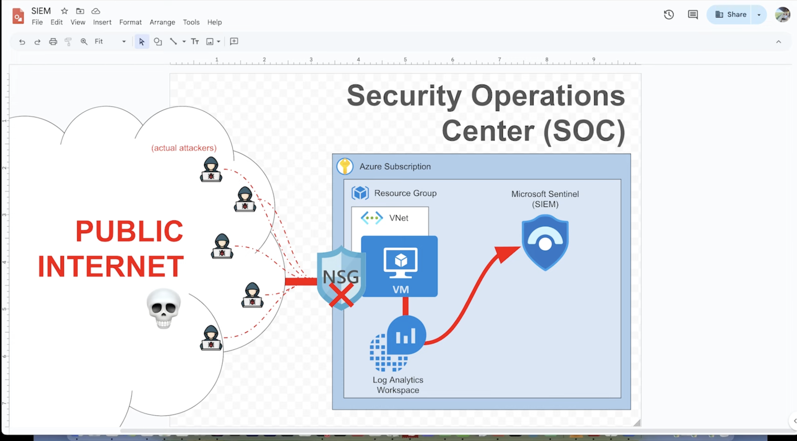
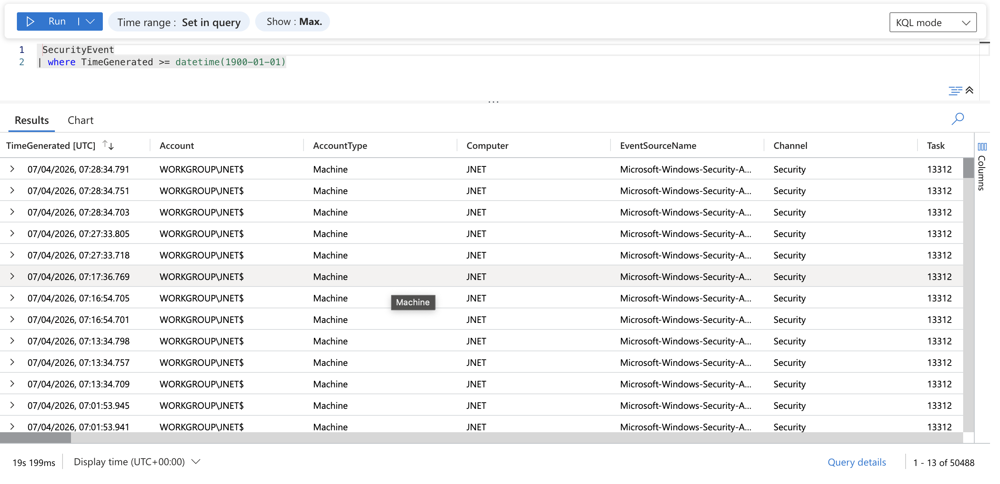
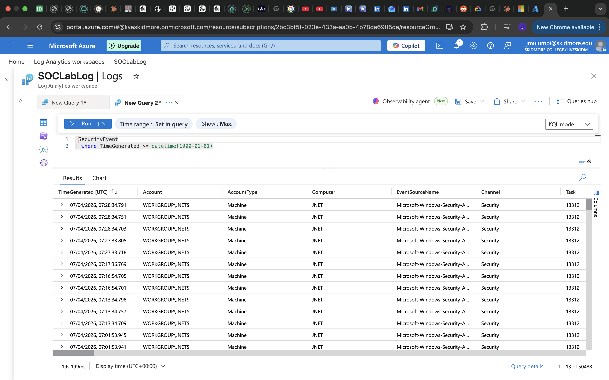
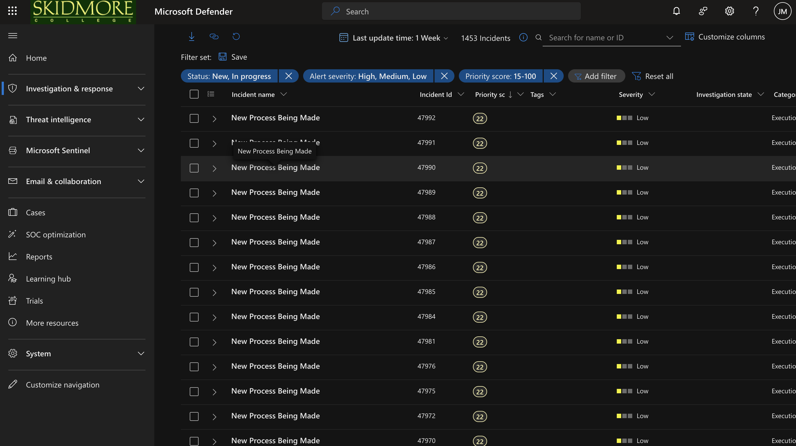
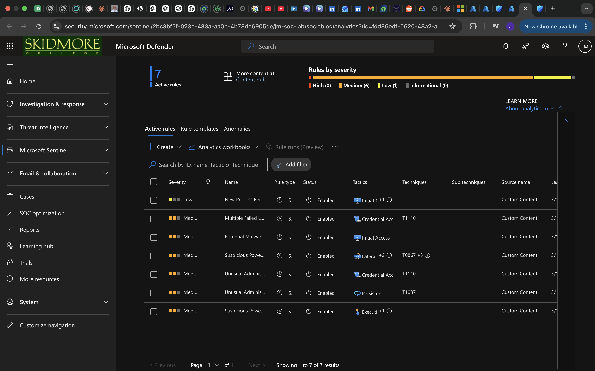
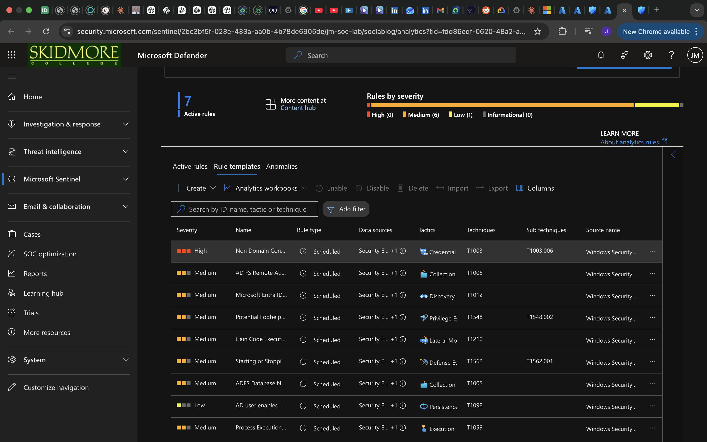
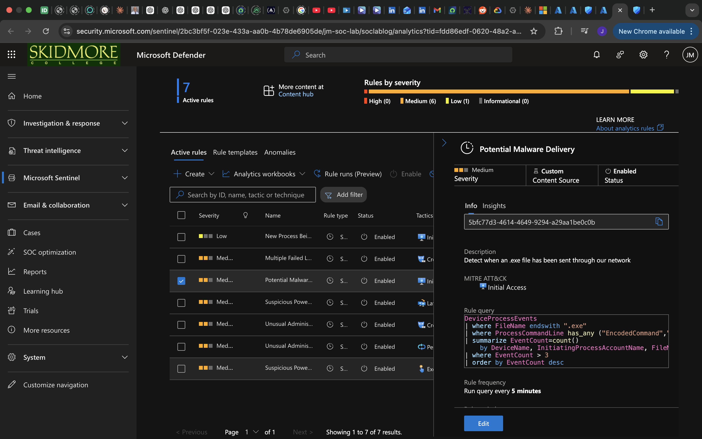
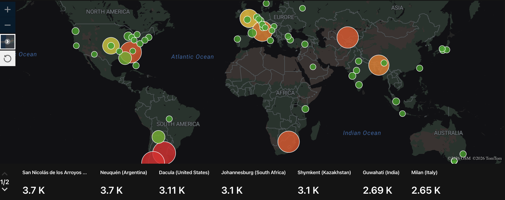
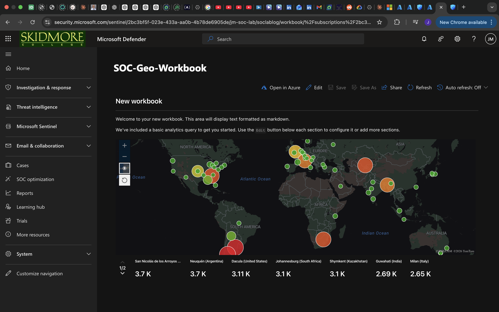

<h1>Cloud SOC Detection Lab</h1>

### [YouTube Demonstration](#) <!-- Add your link when ready -->

<h2>Description</h2>
Built a virtual Security Operations Center (SOC) on Microsoft Azure by deploying a publicly exposed honeypot VM 
to attract and capture real-world attack traffic. Configured log ingestion into a Log Analytics Workspace and 
monitored security events using Microsoft Sentinel. Analyzed 50,000+ security events, investigated 4,000+ failed 
login attempts across 35+ countries using KQL, and built custom detection rules mapped to MITRE ATT&CK. Created 
a geo-visualization workbook to map global attack sources in real time.
 

<h2>Languages and Utilities Used</h2>

- <b>KQL (Kusto Query Language)</b>
- <b>PowerShell</b>

<h2>Platforms and Technologies Used</h2>

- <b>Microsoft Azure</b> (Virtual Machine, VNet, NSG, Public IP)
- <b>Microsoft Sentinel</b> (SIEM)
- <b>Azure Log Analytics Workspace</b>
- <b>Microsoft Defender</b>
- <b>MITRE ATT&CK Framework</b>

<h2>Environments Used</h2>

- <b>Windows Server</b> (JNET — publicly exposed honeypot VM)

---

<h2>Lab Walkthrough</h2>

<h3>Step 1: Lab Architecture</h3>
A Windows VM (JNET) was deployed inside an Azure Resource Group with its Network Security Group (NSG) 
intentionally misconfigured to allow inbound traffic from the public internet — simulating an exposed enterprise endpoint.
Logs flow from the VM → Log Analytics Workspace → Microsoft Sentinel for analysis and alerting.
 
 

---

<h3>Step 2: Azure Resource Setup</h3>
Provisioned all required Azure resources including the Virtual Machine (JNET), Network Security Group (JNET-nsg), 
Public IP (JNET-ip), Virtual Network (VM-SOC-LAB), Log Analytics Workspace (SOCLabLog), and a 
Brute-Force-IP-Playbook Logic App for automated response.
 
 

---

<h3>Step 3: Log Ingestion — Security Events Captured</h3>
Queried the Log Analytics Workspace using KQL to confirm live security event ingestion from the honeypot VM. 
Over 50,000 security events were captured, including machine authentication events from WORKGROUP\JNET$.
 
 

---

<h3>Step 4: Incident Management in Microsoft Sentinel</h3>
Microsoft Sentinel generated 1,453 incidents over one week, filtered by High/Medium/Low severity with priority 
scores of 15–100. Incidents were triaged and investigated through the Investigation & Response workflow in 
Microsoft Defender.
 
 

---

<h3>Step 5: Custom Detection Rules (Analytics)</h3>
Wrote and deployed 7 custom Scheduled analytics rules in Microsoft Sentinel mapped to MITRE ATT&CK tactics 
including Credential Access, Initial Access, Lateral Movement, Persistence, and Execution.
 
 

---

<h3>Step 6: Rule Detail — Multiple Failed Log-In Attempts</h3>
Custom KQL rule detecting brute-force activity by flagging any source IP with more than 10 failed login attempts 
(Event ID 4625) within a time window, grouped by IP address, username, and computer. Mapped to MITRE ATT&CK 
T1110 — Credential Access.
 
 

---

<h3>Step 7: Rule Detail — Potential Malware Delivery</h3>
Custom KQL rule detecting suspicious .exe file delivery over the network by monitoring 
<code>DeviceProcessEvents</code> for encoded command execution. Triggers when event count exceeds 3, 
running every 5 minutes. Mapped to MITRE ATT&CK — Initial Access.
 
 

---

<h3>Step 8: Geo-Visualization Workbook</h3>
Built a SOC-Geo-Workbook in Microsoft Sentinel to visualize attack origin locations on a world map. 
Top attack sources included Argentina (3.7K), United States (3.11K), South Africa (3.1K), 
Kazakhstan (3.1K), India (2.69K), and Italy (2.65K).
 
 

